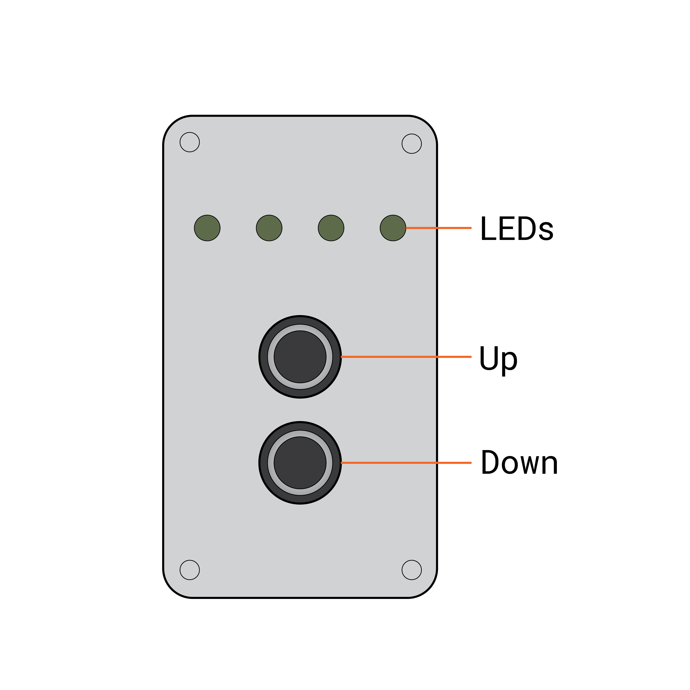

## 4.1 Remote Programming

### Viewing list of crossings

{: style="height:350px;width:350px"}

* Press and hold the ``UP`` button first immediately followed by the ``DOWN`` button, holding both ``UP`` and ``DOWN`` buttons for ``5 seconds``
* All 4 LEDs will blink blue when viewing mode is active
* While in viewing mode, press the ``UP`` and ``DOWN`` arrows to navigate the list of paired Portable Crossing Gates

{: style="height:350px;width:350px"}

* Paired crossings are listed in binary, the number of the crossing represented by the number of LEDs illuminated in white
* To exit viewing mode, wait ``15 seconds``

---

**Pairing a Crossing**

{: style="height:350px;width:350px"}

* While in viewing mode, hold the ``UP`` button for ``5 seconds`` until all 4 LEDs blink yellow repeatedly to enter pairing mode
* Locate the control enclosure on the Portable Crossing Gate you wish to pair. Open the enclosure to expose the three control buttons. The pairing button is located in the center and colored blue with a radio icon
* Press the blue button on the Portable Crossing Gate to pair
* When crossing is paired, LEDs will blink to indicate a successful connection
* To pair another Portable Crossing Gate, bring the remote to the next crossing and press the blue pairing button within ``15 seconds``
* Press any button to return to viewing mode
* Wait ``15 seconds`` to return to normal control mode
---

**Removing a Paired Crossing Gate**

* In viewing mode, navigate to the number of the crossing you wish to remove, indicated in binary by the number of LEDs illuminated
* Hold the ``DOWN`` button for ``5 seconds`` until the LEDs indicating the number of the crossing to remove blink red to show that it has been successfuly removed

**Exiting to Control Mode**

* From either viewing mode or pairing mode, wait ``15 seconds`` to return to normal control mode
* Any updates made to the list of paired crossings will be applied

## 4.2 Remote Operation

**Charging the Remote**

* Use the provided wireless charging cradle provided to keep the remote fully powered
* **Always leave the remote on the cradle when not in use**
  
**Moving the Crossing Arm**

Note that the remote control is always on when charged. Pressing either the ``UP`` or ``DOWN`` button will immediately activate the crossing when in range.

> ⚠️ Ensure that the arm's travel path is clear before raising or lowering to prevent injury or damage to equipment.

* Press the ``UP`` button to raise the arm
* Press the ``DOWN`` button to lower the arm

---

## 4.3 Video Reference

[Link to Shared Drive](https://drive.google.com/drive/folders/1m8iu9sO9QyP0LjTphAF3QGKxYsJJ6iOA?usp=drive_link)

---
