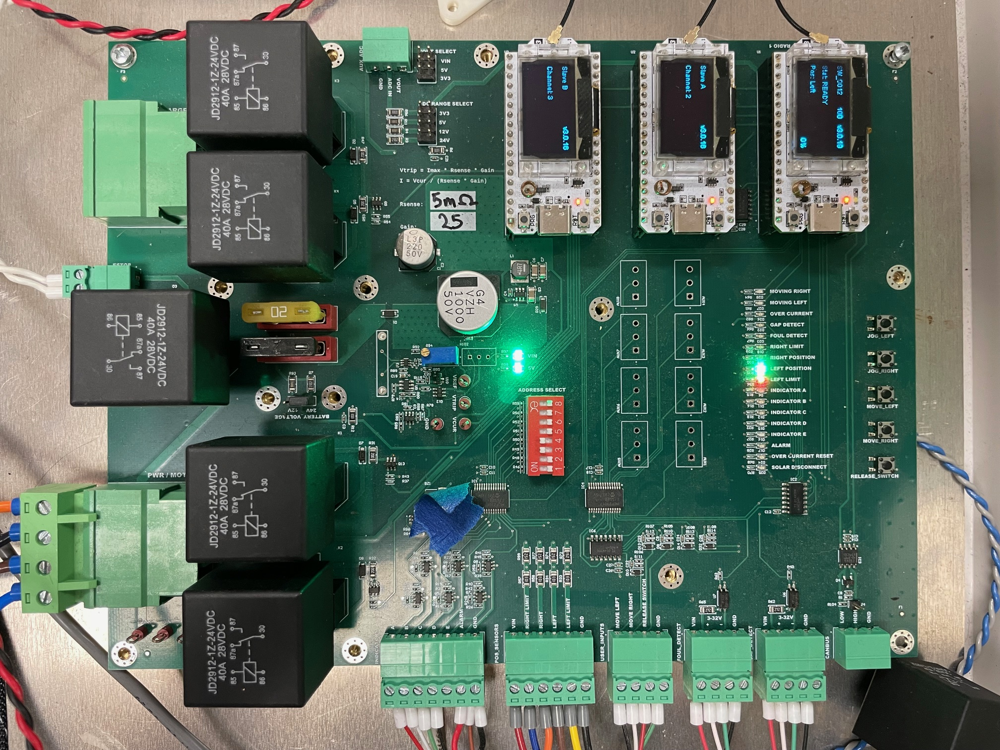
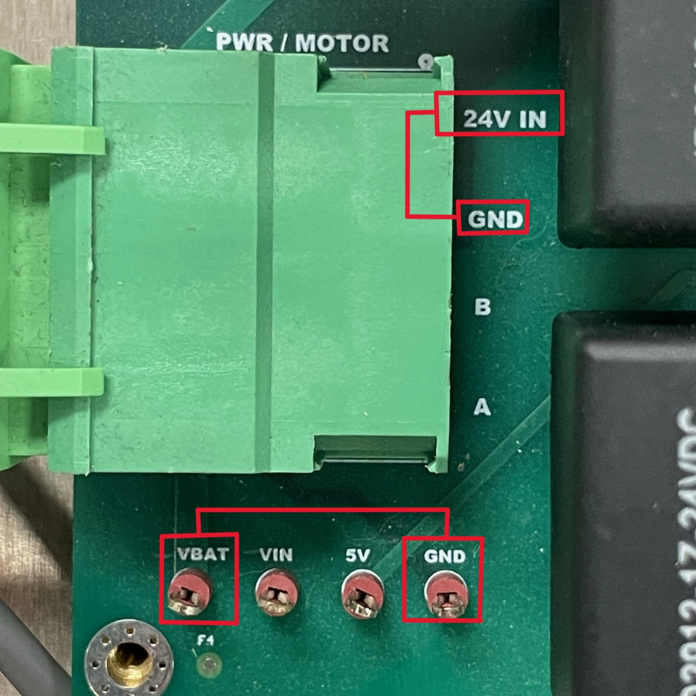
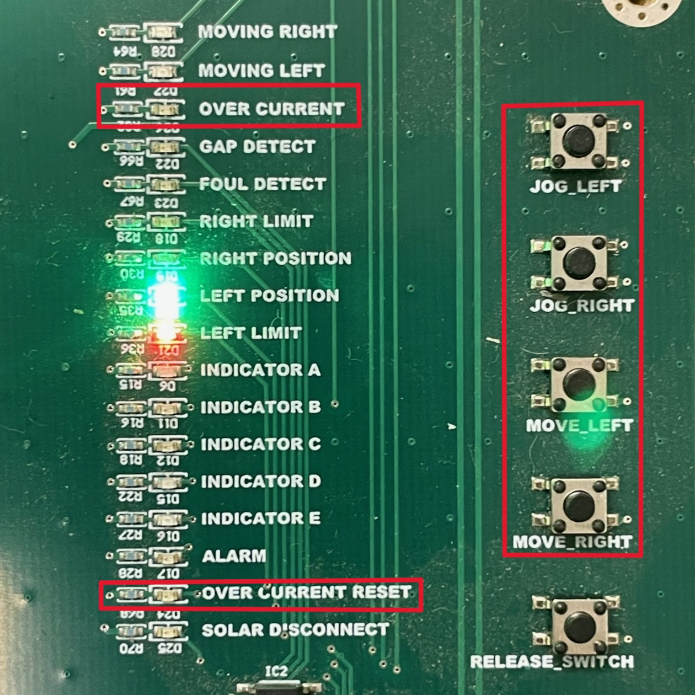
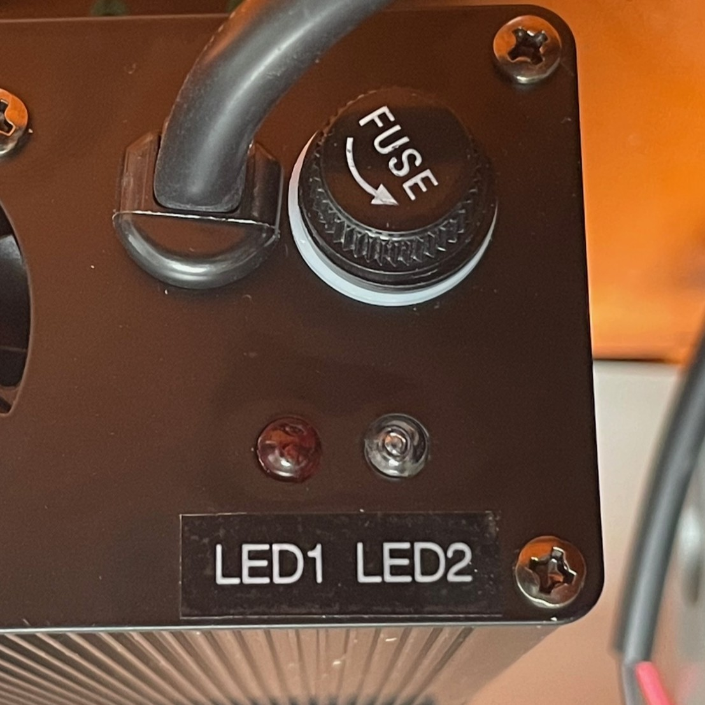
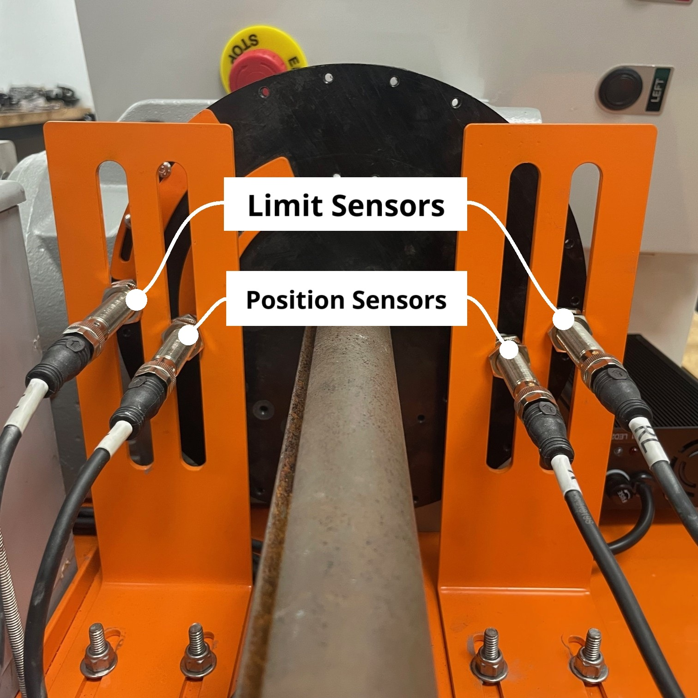
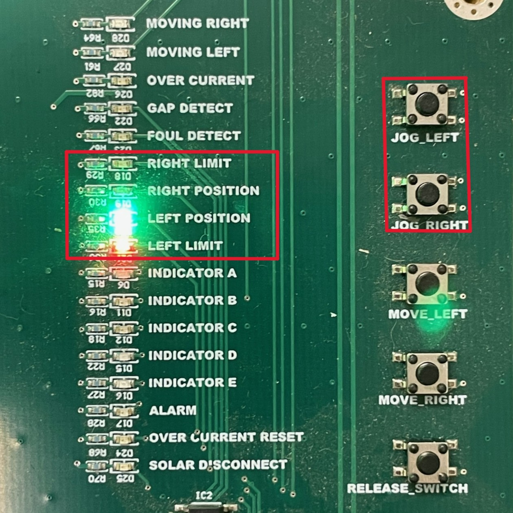

## Introduction
This manual is for use by qualified technicians for onsite troubleshooting of the RAR automated switch system. This is not a product manual or schematic. This manual covers only the steps to diagnose issues, and should not be used to repair or modify the RAR.

## Troubleshooting
1. Verify that the device is connected to a working power source

2. Visually inspect the status lights
    *  Green : Operator is currently connected to device
    *  Yellow  : Device is currently in motion
    *  Red : Error

3. Visually inspect the switch
    * If switch is obstructed or housing is visibly rotated off of the ground, refer to [Overcurrent Issues](#overcurrent-issues)

4. Open enclosure and check for any error codes or status lights. 
    * Verify that the device is in the correct mode for local control and that no remote users are connected
    * Ensure that cable, relay, and fuse connections are secure

    {: style="height:350px;width:350px"}

5. Disconnect plug labeled `Charger` and measure input voltage
    * Using a multimeter, probe across `24V IN` and `GND`, or `VBAT` and `GND`
    * **Perform this step before proceeding as low voltage may present as other errors**
    * If board is receiving less than `24V`, refer to [Charger Issues](#charger-issues)

6. Verify that sensors are securely connected and in the correct positions
    * Refer to [Sensor Issues](#sensor-issues)

7. If board is receiving `24V`, no other issues have been found, and errors are still present:
    * Refer to [Board Issues](#board-issues)

### Overcurrent Issues

{: style="height:350px;width:350px"}        

* Overcurrents may be caused by an obstruction in the switch, or a sudden change in the load experienced by the motor
* The `Over Current Reset` light indicates an overcurrent issue has occurred 
* After an overcurrent issue, the RAR must be reset to unlock movement
* Upon resetting, use `Jog Left` and `Jog Right` buttons to test for resistance throughout the range of travel
* Once any obstructions have been removed and motion has been tested, close lid and use `Move Left` and `Move Right` buttons to ensure error has been fully cleared

### Charger Issues

{: style="height:350px;width:350px"}    

* If battery is providing less than `24V`, there may be an issue with the battery charger
* Battery charger features two status lights, red (LED1) indicates charging is active, while green (LED2) turns on when the battery is fully charged
* **If charger is not functioning, replace fuse**

### Relay Issues

The RAR board features six relays. One for each motor direction, one for overcurrent, one for the emergency stop, and two for the battery charger.

#### Motor relays
* If the motor is only functioning in one direct, swap A&B relays

#### Charger Relays

### Sensor Issues

{: style="height:350px;width:350px"}        

Each end stop has two sensors: a `Position` switch in the inside slot, close to the center of the disc, and a `Limit` switch in the slot nearer to the edge. As the motor approaches either end stop, the position switch will always trigger first, followed by the limit switch.

{: style="height:350px;width:350px"}     

Each sensor features its own indicator light and a corresponding status light on the board. 

* For example, when the motor approaches the right endstop, `Right Position` will trigger before `Right Limit`
* `Right Limit` triggering before `Right Position` indicates an improper connection order
* If `Right Limit` triggers by itself, without `Right Position` being triggered first, this also shows a connection problem

Conversely, the sensors corresponding to the same side will always trigger in sequence.

* For example, `Left Position` will trigger followed by `Left Limit` when the motor reaches the left endstop
* `Right Position` triggering followed by `Left Limit` demonstrates an sensor is connected in an improper location

**Use the **`Jog`** buttons to verify that each sensor functions and is in the correct position.**

### Board Issues

If the above troubleshooting steps have been performed, and an issue has not been isolated, the fault may be with the board itself.

* To test the board, use a multimeter to measure the output voltage
* If board is receiving 24 Volts, and output voltage measures 0 Volts, disconnect power and swap the board with a new replacement
