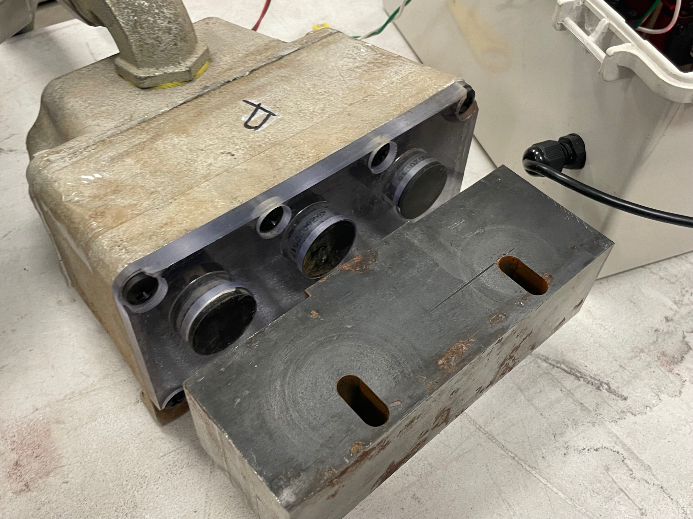

# Switch Gap Detector Troubleshooting Manual

## Introduction
This manual is for use by qualified technicians for onsite troubleshooting of the RAR automated switch system. This is not a product manual or schematic. This manual covers only the steps to diagnose issues, and should not be used to repair or modify the Switch Gap Detector.

### Required Equipment
* Multimeter
* 1/8" Flat head screwdriver
* Personal protective equipment

### Safety Information
* Read all instructions before troubleshooting
* Disconnect power before servicing
* Use personal protective equipment as needed

## Troubleshooting
1. Verify that the device is connected to a working power source

2. Visually inspect the status light
    *  Green : No gap detected
    *  Red : Gap detected

3. Visually inspect the switch
    * Check switch tip for gap, verify that status light color matches observed condition
    * Look for obstructions or wear to the switch that may cause a gap
    * If the observed switch condition conflicts with the status light, refer to [Calibration](#calibration)

4. Test device
    * Throw switch while observing status light
    * Verify that status light is  Green  when switch is in either thrown position, and  Red  while moving
    * Verify that switch gap is within acceptable tolerance
    * To adjust switch gap distance, refer to [Calibration](#calibration)

    {: style="height:350px;width:350px"}

### Calibration

* Hold both ``left`` and ``right`` buttons for ``5 seconds`` to enter calibration mode
* Throw the switch to the position of the sensor being calibrated
* To set the offset for each detector, hold down the corresponding button for 2 seconds until the LEDs blink
* The maximum gap distance that can be set is ``13.75mm``, the furthest the sensors can read
